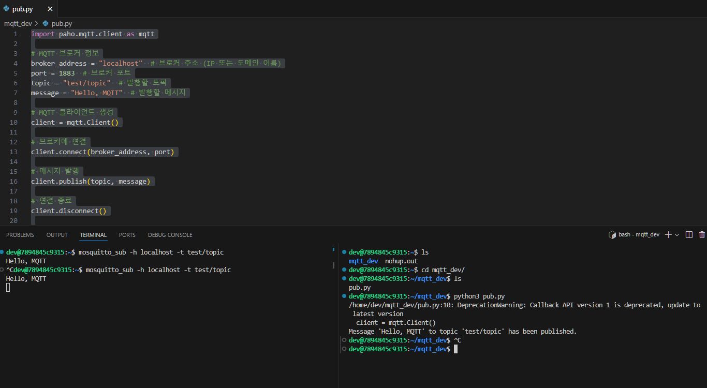

```shell
pip install paho-mqtt
```

mqtt broker 켜져있어야함
```
nohup sudo mosquitto -c /etc/mosquitto/mosquitto.conf &
```

publisher.py
```python
import paho.mqtt.client as mqtt
# MQTT 브로커 정보
broker_address = "localhost"  # 브로커 주소 (IP 또는 도메인 이름)
port = 1883  # 브로커 포트
topic = "test/topic"  # 발행할 토픽
message = "Hello, MQTT"  # 발행할 메시지

# MQTT 클라이언트 생성
client = mqtt.Client()
# 브로커에 연결
client.connect(broker_address, port)
# 메시지 발행
client.publish(topic, message)
# 연결 종료
client.disconnect()
print(f"Message '{message}' to topic '{topic}' has been published.")
```

subscriber.py

subscriber
```sh
mosquitto_sub -h localhost -t test/topic
```

publisher
```sh
 mosquitto_pub -h localhost -t test/topic -m "Hello, MQTT"
```


