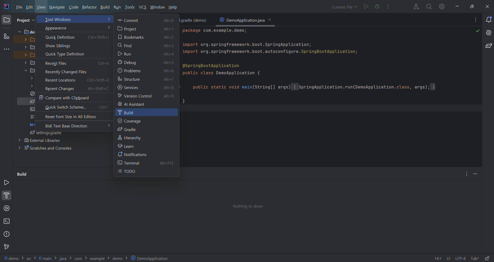

### intellij 설치

생략
#### Windows Defender 설정


#### intellij 를 통해 jdk 설치


#### Tool Windows 에서 build


### spring initializer 로 시작 코드 생성

intellij communication 은 spring 시작 코드를 생성할 수 없음
spring 재단이 제공하는 Web spring initializer 사용

https://start.spring.io/


### spring-web dependancy 추가

### 포트 변경
기본값은 8080 포트.
application.properties 에 아래 문자열 추가
```
server.port = 8080
```

### Springboot web 실행 및 테스트
실행이 우선 되고 나서 개발해야하니 코딩 전에 먼저 제대로 작동하는지 테스트할 것.

build 후, demo/src/main/java/com.example.demo/DemoApplication 의 main 함수를 실행,
웹브라우저로 localhost:설정된 포트로 접속

HTTP 404 에러면 실패, white label error 가 출력되면 성공
